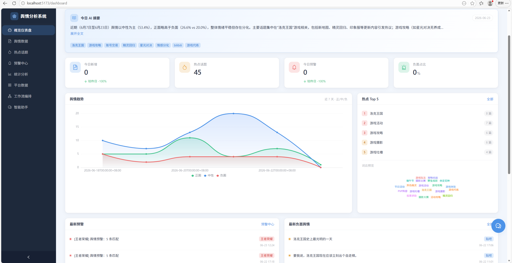
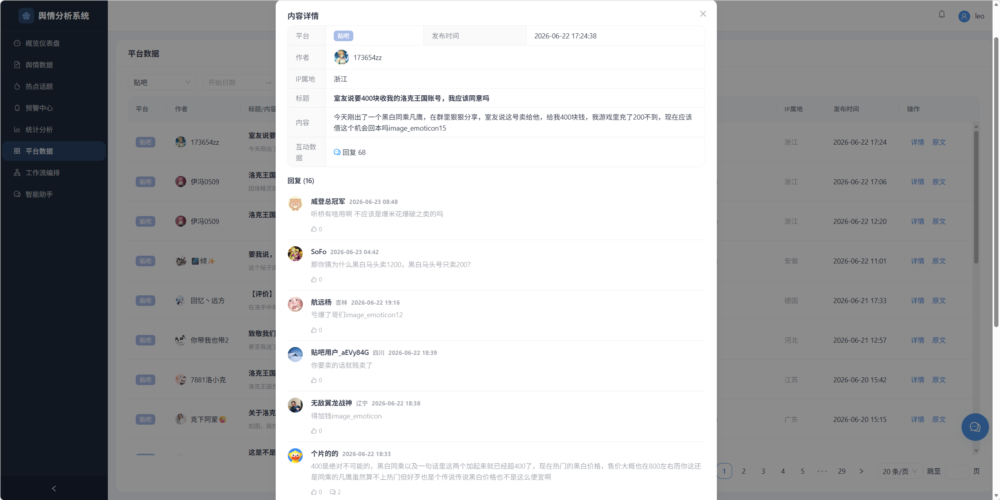
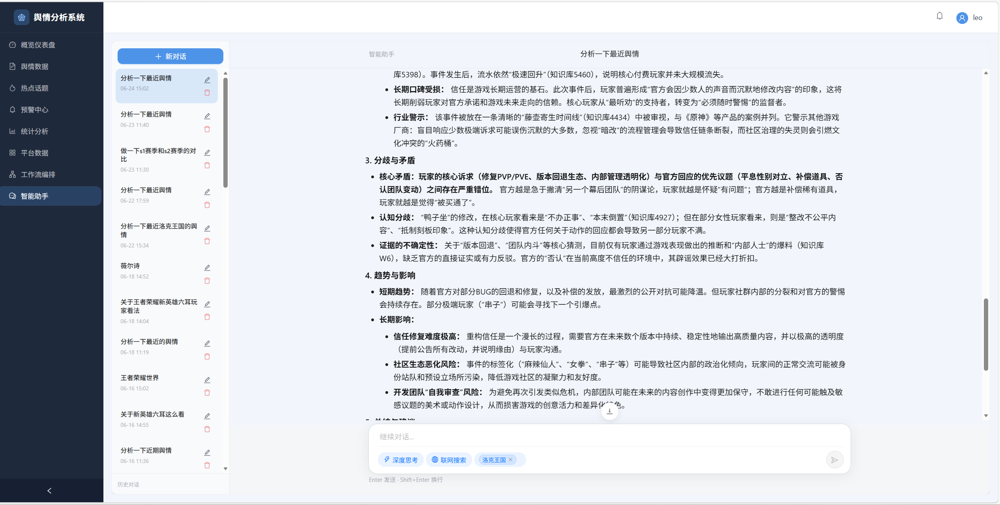
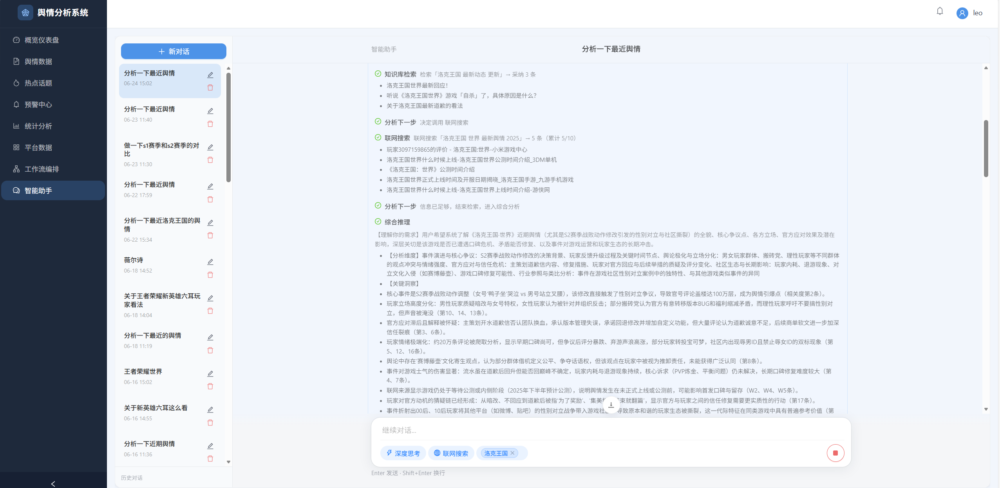
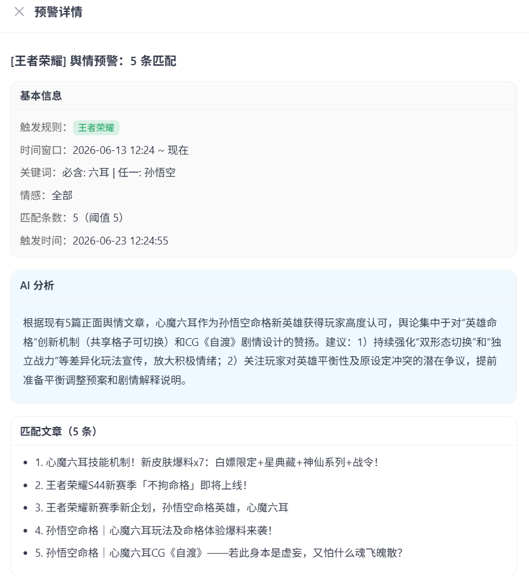
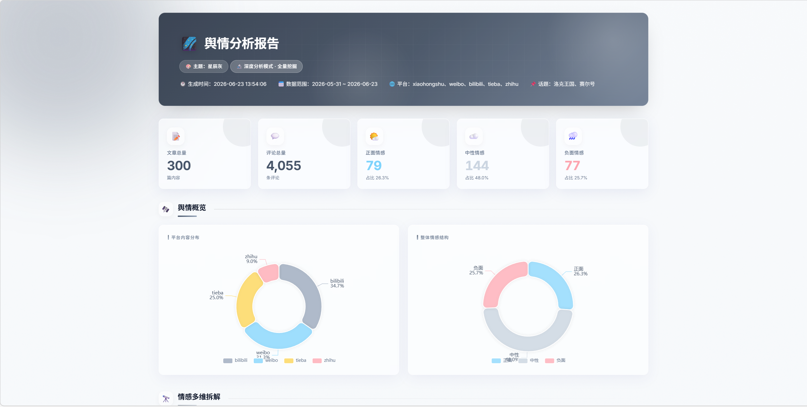
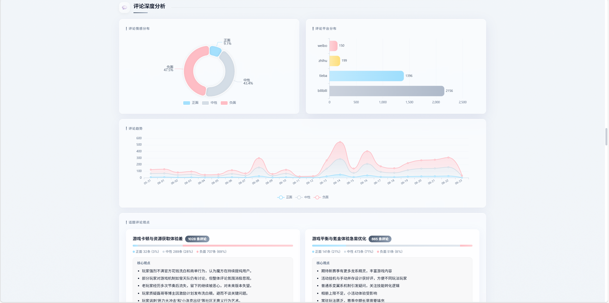
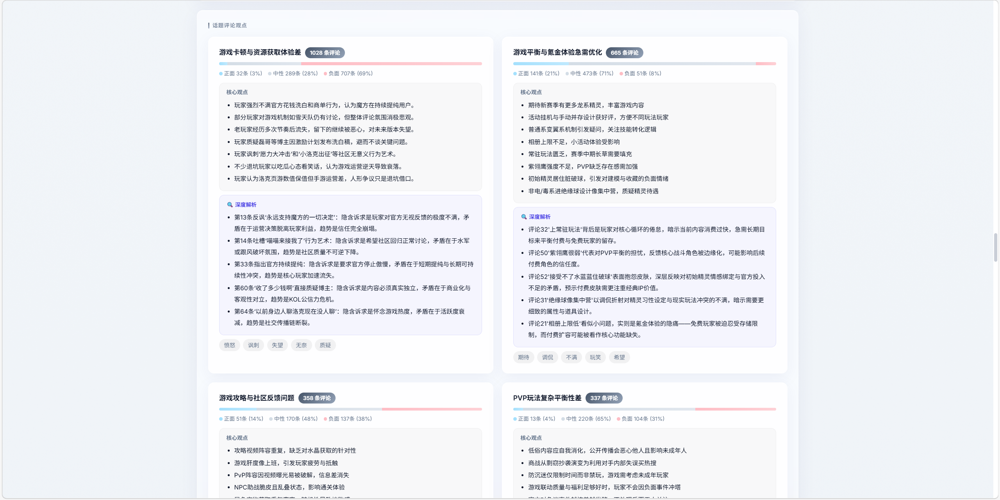
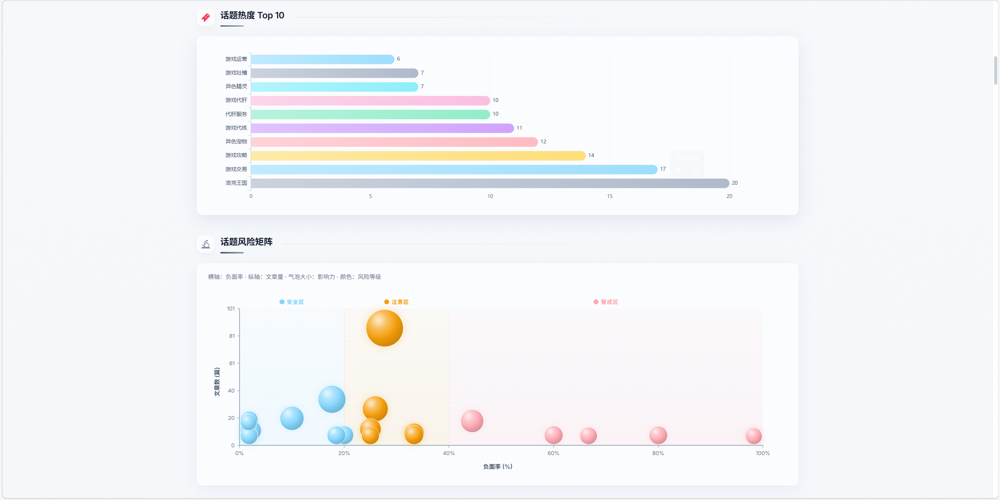
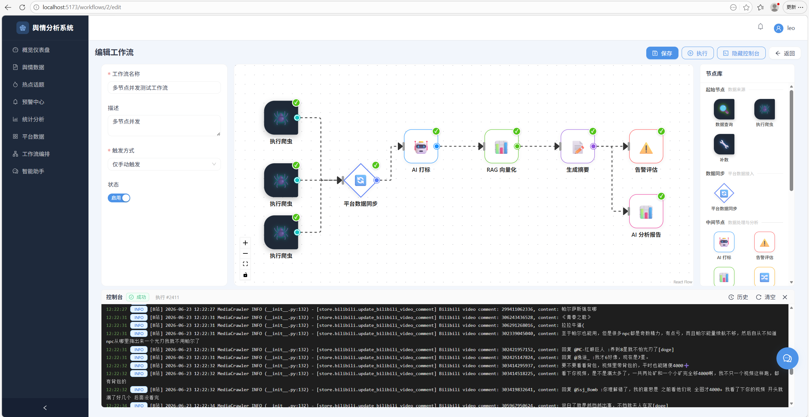

# AI舆情分析系统

基于 AI 的中文舆情监测与分析平台。系统从 7 个社交媒体平台采集内容，通过大模型自动打标与情感分析，结合 Milvus 向量库实现 RAG 智能问答，并通过两个 React 前端展示分析结果。

---

## 目录

- [功能特性](#功能特性)
- [技术架构](#技术架构)
- [项目结构](#项目结构)
- [环境准备](#环境准备)
- [本地启动](#本地启动)
- [配置说明](#配置说明)
- [Docker 部署](#docker-部署)
- [访问地址](#访问地址)

---

## 功能特性

- **多平台内容采集**：驱动 MediaCrawler（Playwright）深度采集小红书、抖音、快手、微博、B 站、贴吧、知乎共 7 个平台的帖子与评论；同时从 NewsNow 聚合 12 个平台的热榜关键词作为采集入口
- **AI 自动打标**：后台 goroutine 定时批量调用大模型（DeepSeek / OpenAI / Qwen 等）为文章生成话题标签
- **情感分析**：LLM 主力 + SnowNLP 回退，自动标记文章正负情感倾向
- **RAG 智能问答**：Go 直连 Milvus + Python embedding 服务(可配置），支持语义检索与 AI 多轮对话
- **预警规则引擎**：自定义关键词 / 情感 / 平台组合预警，实时触发告警记录
- **工作流引擎**：可视化编排爬虫→处理→分析节点，支持定时调度与手动触发
- **数据可视化**：ECharts 趋势图、词云、平台分布、话题热度看板
- **管理后台**：用户管理、系统配置、RAG 知识库管理、爬虫运维、审计日志

---

## 功能演示与核心亮点

### 📊 实时数据看板



系统首页提供多维度舆情监控，包括系统总览（文章数、新增、平台数）、热点分析（词云与趋势）、负面舆情快速浏览、舆情告警快照、平台分布与话题热度排行。采用 ECharts 5 + echarts-wordcloud 实现可视化。

---

### 📰 多平台并发爬虫



**技术亮点：** 基于 Playwright 浏览器自动化，7 个平台（小红书、抖音、快手、微博、B 站、贴吧、知乎）并发爬取

**核心特性：**

- **进程级隔离**：每个平台独立 CrawlerManager 实例，维护独立的 subprocess 和日志队列
- **并发爬取**：Go 通过 goroutine 并发调用，7 平台同时启动，总耗时 = 最慢平台耗时
- **Playwright 自动化**：独立 CDP 端口（9222-9228）+ 独立 `user_data_dir`，避免 Cookie 冲突
- **AI 自动打标**：后台 goroutine 批量调用 LLM 生成话题标签，支持 DeepSeek / OpenAI / Qwen
- **情感分析**：LLM 主力 + SnowNLP 回退，自动标记正负情感倾向

**技术难点：** 各平台反爬策略、Playwright 资源控制（每平台 300-500MB）、多进程日志聚合与全局时序排序、IP 代理池与请求频率动态调整

---

### 🤖 RAG 智能助手 - 混合检索 + 深度思考





**技术亮点：** BM25 + Dense 双路召回 + 话题分区管理 + ReAct 推理框架 + 自反思循环 + Function Call 工具链

**BM25 + Dense 混合检索：**

1. **BM25 稀疏检索**：基于词频-逆文档频率，擅长精确匹配（品牌名、专有名词）
2. **Dense 向量检索**：基于 Sentence-Transformers 语义 Embedding
3. **RRF 融合排序**：Reciprocal Rank Fusion 算法融合两路结果
4. **Milvus 原生支持**：使用 Milvus 2.4+ 混合检索 API

**Milvus 分区管理：**

- **自动分区创建**：爬虫工作流根据话题配置自动创建 Milvus 分区
- **精准检索**：用户选择话题后限定分区范围，减少噪音，检索速度提升 3-5 倍，准确率提升 20-30%
- **跨分区聚合**：支持多话题联合检索

**ReAct 推理框架 - 思考-行动-观察循环：**

系统采用 ReAct（Reasoning and Acting）推理范式，将 LLM 的推理过程拆解为可观测、可纠错的多步骤循环，突破传统单轮问答的局限。

1. **用户意图识别（Intent Recognition）**
  - 多分类器并行识别：问答查询 / 数据分析 / 趋势预测 / 对比分析 / 深度研究
  - 实体抽取：自动识别查询中的平台名、话题关键词、时间范围、情感倾向
  - 查询重写：将口语化问题转化为结构化检索表达式（如"最近小红书负面评价多吗" → `platform=xhs AND sentiment<-0.3 AND time>7d`）
2. **Thought（思考）- 深度推理链**
  - **Chain-of-Thought（CoT）推理**：将复杂问题分解为子问题序列（如"对比抖音和小红书用户对某产品的态度差异" → 分解为"1.检索抖音相关内容 2.检索小红书相关内容 3.情感对比分析 4.用户画像差异"）
  - **Self-Reflection（自反思）**：每一步推理后评估置信度，低于阈值触发重新思考或工具调用
  - **动态规划**：根据中间结果动态调整后续步骤（如检索结果不足 → 扩大时间范围或放宽筛选条件）
3. **Action（行动）- Function Call 工具链**
  - **RAG 检索工具**：`search_knowledge_base(query, partition, top_k, filters)`
  - **数据统计工具**：`get_article_stats(platform, time_range, sentiment)`
  - **趋势分析工具**：`analyze_trend(topic, time_window)`
  - **联网搜索工具**：`web_search(query, freshness)` - 当知识库无法回答时自动触发
  - **情感对比工具**：`compare_sentiment(topic, platforms)`
   每个工具返回结构化 JSON，供下一轮推理使用。支持工具级联（如"先检索 → 再统计 → 最后生成图表"）
4. **Observation（观察）- 结果评估与循环**
  - **置信度评分**：根据检索结果相似度、数据覆盖度、时间新鲜度综合打分
  - **答案完整性检查**：是否覆盖用户问题的所有维度？是否存在逻辑漏洞？
  - **自动重试机制**：
    - 检索结果 < 3 条 → 放宽筛选条件重新检索
    - 置信度 < 0.6 → 触发联网搜索补充
    - 发现矛盾信息 → 启动多源验证（RAG + Web + 数据统计三方交叉）
  - **Loop 循环思考**：最多 5 轮 Think-Act-Observe 循环，直到置信度达标或达到最大轮次

**推理流程示例：**

```
用户问题：最近一周新能源汽车在小红书的讨论中，用户最关心什么？

Round 1 - Think: 需要检索小红书近 7 天关于"新能源汽车"的内容
Round 1 - Act: 调用 search_knowledge_base(query="新能源汽车", partition="xhs", time_range="7d")
Round 1 - Observe: 检索到 127 篇文章，置信度 0.75，继续

Round 2 - Think: 需要提取高频关注点，进行语义聚类
Round 2 - Act: 调用 analyze_trend(topic="新能源汽车", platform="xhs", method="clustering")
Round 2 - Observe: 聚类得到 5 个主题簇，置信度 0.82，继续

Round 3 - Think: 需要结合评论数据验证用户真实关注点
Round 3 - Act: 调用 get_comment_keywords(articles=top_20, min_frequency=10)
Round 3 - Observe: 提取到高频关键词：续航、充电、价格、智能座舱、安全性，置信度 0.91，达标

Final Answer: 根据近 7 天小红书 127 篇讨论，用户最关注五大问题...（附数据来源与置信度）
```

**多轮对话与上下文管理：**

- **会话记忆**：前端维护完整对话历史，后端提取关键实体与意图持久化
- **指代消解**：自动识别代词指代（如"它的价格呢？" → 识别"它"指代上一轮提到的产品）
- **渐进式深入**：用户追问时自动继承上一轮的筛选条件与上下文

**技术难点：** 

- BM25 与 Dense 权重平衡调优
- 中文分词对 BM25 效果的影响（jieba）
- Milvus Schema 设计（同时支持向量索引和 BM25 函数）
- ReAct 循环的终止条件设计（避免死循环与过度推理）
- Function Call 工具链的参数校验与异常恢复
- 多轮对话的上下文压缩（控制 Token 成本）
- 自反思的置信度建模（避免误判导致无限重试）

---

### ⚠️ AI 驱动的预警分析 + 多渠道推送



**技术亮点：** 规则引擎 + AI 分析 + 多渠道自动推送（邮件、钉钉、企业微信）

**实现原理：**

1. **规则引擎**：使用 `govaluate` 库支持复杂表达式（如 `(platform == "weibo" || platform == "xhs") && sentiment < -0.5 && keyword contains "质量问题"`）
2. **实时匹配**：后台 goroutine 定时扫描新文章，评估是否触发预警
3. **AI 告警分析**：LLM 自动生成风险等级、传播趋势预测、应对建议
4. **多渠道推送**：支持 SMTP 邮件、钉钉 Webhook、企业微信机器人，按告警等级配置不同推送渠道

**技术难点：** 规则表达式安全性（防注入）、海量文章实时匹配性能优化、推送去重与限流

---

### 📈 自适应预算深度分析报告









**技术亮点：** 在有限 Token 成本下，通过五阶段流水线从海量数据中深度挖掘价值信息

**完整分析流程：**

1. **质量预过滤**：时间衰减、互动指标、长度校验、去重（SimHash），过滤 30-40% 噪音
2. **轻量打分**：低成本模型（DeepSeek-Chat）快速打分（0-100 分），50 篇 < 10 秒
3. **预算分配与分层采样**：高分文章分配 30% 预算采样全部评论，中分 50%，低分 20%
4. **Embedding 语义聚类**：DBSCAN/K-Means 自动识别 3-8 个主题簇，识别跨平台传播路径
5. **深度分析生成**：高质量模型生成报告（舆情概览、热点话题、负面预警、用户洞察、应对建议）

**实测效果：** 500 篇文章 + 10000 条评论 → 耗时 3-5 分钟 → Token 消耗 30-50 万（成本 3-5 元）→ 覆盖 85%+ 关键信息

**技术难点：** Token 成本建模、重要性打分指标设计、聚类参数调优、预算分配鲁棒性

---

### 🔄 可视化工作流引擎



**技术亮点：** 类 Airflow/N8N 的 DAG 工作流编排，支持爬虫、处理、分析节点的灵活组合

**节点类型：**

- **爬虫节点**：7 平台独立配置，支持多平台并发、动态参数传递
- **数据处理节点**：数据查询（SQL）、AI 打标、RAG 同步、数据转换
- **控制节点**：条件分支、循环、延迟
- **分析与行动节点**：深度分析、告警、导出（Excel/PDF）、Webhook

**高级特性：**

- **并行执行**：自动识别无依赖节点，动态资源分配
- **错误处理**：自动重试、失败继续模式、失败告警（钉钉/邮件）
- **版本管理**：工作流配置版本化，支持一键回滚

**典型工作流：** 定时触发 → 7 平台并发爬取 → AI 打标 → RAG 同步 → 条件分支（负面文章 > 50?）→ 深度分析 → 钉钉推送

**技术难点：** 循环依赖检测、节点失败异常传播、大规模并行资源调度、动态参数类型校验、断点续跑

---

## 技术架构

### 服务组成

系统由 5 个独立进程组成：


| 服务               | 语言 / 框架                      | 端口   | 目录                |
| ---------------- | ---------------------------- | ---- | ----------------- |
| Go API 后端        | Go 1.24、Gin + GORM           | 8080 | `backend/`        |
| 用户端前端            | React 18 + Vite + Ant Design | 5173 | `frontend/`       |
| 管理后台前端           | React 18 + Vite + Ant Design | 5174 | `frontend-admin/` |
| RAG embedding 服务 | Python、FastAPI + Milvus      | 5055 | `rag/`            |
| MediaCrawler 爬虫  | Python、Playwright + FastAPI  | 8085 | `MediaCrawler/`   |


### 架构图

```
┌──────────────────────────────────────────────────────────────────┐
│                         用户 / 管理员                             │
└──────────────┬───────────────────────────────┬───────────────────┘
               │                               │
               ▼                               ▼
  ┌────────────────────┐           ┌───────────────────────┐
  │    用户端前端        │           │     管理后台前端        │
  │  React + ECharts   │           │   React + Ant Design  │
  │  :5173 (dev)       │           │   :5174 (dev)         │
  └─────────┬──────────┘           └────────────┬──────────┘
            │                                   │
            └───────────────┬───────────────────┘
                            │  REST API / SSE
                            ▼
               ┌────────────────────────┐
               │      Go 后端 API        │
               │   Gin + GORM   :8080   │
               │                        │
               │  ┌──────────────────┐  │
               │  │  AI 打标 goroutine│  │ ← 大模型 API
               │  │  情感分析 / 预警  │  │   DeepSeek / OpenAI
               │  └──────────────────┘  │
               │  ┌──────────────────┐  │
               │  │  工作流引擎       │  │
               │  │  定时调度器       │  │
               │  └──────────────────┘  │
               └───────────┬────────────┘
                           │
           ┌───────────────┼──────────────────┐
           │               │                  │
           ▼               ▼                  ▼
      ┌─────────┐  ┌──────────────────┐  ┌─────────┐
      │  MySQL  │  │  RAG embedding   │  │  Redis  │
      │  :3306  │  │  FastAPI  :5055  │  │  :6379  │
      │         │  │  Milvus :19530   │  │ （可选） │
      └─────────┘  └────────┬─────────┘  └─────────┘
           ▲                │ embedding
           │                ▼ 向量检索
           │       ┌──────────────────┐
           │       │ Milvus Standalone│
           │       │    :19530        │
           │       └──────────────────┘
           │
  ┌────────────────────────────┐
  │    MediaCrawler 爬虫        │
  │    FastAPI  :8085           │
  │                             │
  │  Stage 1: 热榜关键词提取    │ ← NewsNow（12 平台热榜）
  │  DeepSeek 提炼关键词        │   + DeepSeek LLM
  │                             │
  │  Stage 2: 深度内容采集      │ ← Playwright
  │  xhs / dy / ks / bili /    │   自动化浏览器
  │  weibo / tieba / zhihu     │
  └────────────┬────────────────┘
               │ 写入 articles 表
               ▼
            MySQL
```

### 数据流向

1. **采集**：MediaCrawler 爬虫定时运行两阶段管道，将采集内容同步至 MySQL `articles` 表
2. **打标**：Go 后端 AI 打标 goroutine 定时扫描未处理文章，批量调用 LLM 生成 `ai_tags` 与情感分数
3. **向量化**：RAG 服务增量同步 MySQL 文章到 Milvus 向量库
4. **问答**：用户发起 AI 对话 → Go 后端经 RAG 服务检索相关文章片段 → 构建增强 Prompt → LLM 流式输出

### 主要技术选型

**后端（Go）**


| 技术               | 用途                   |
| ---------------- | -------------------- |
| Go 1.24 + Gin    | HTTP 框架，SSE 流式输出     |
| GORM + MySQL 8   | ORM，AutoMigrate 自动建表 |
| golang-jwt v5    | JWT 认证               |
| Viper            | YAML 配置加载            |
| Zap              | 结构化日志                |
| Knetic/govaluate | 预警规则表达式求值            |
| Redis 7          | 爬虫去重缓存（可选）           |


**Python 服务**


| 技术                           | 用途                            |
| ---------------------------- | ----------------------------- |
| FastAPI + Uvicorn            | RAG HTTP 接口                   |
| PyMilvus + Milvus standalone | 向量存储与检索                       |
| Sentence-Transformers        | 本地 embedding（支持切换 OpenAI API） |
| Playwright                   | 浏览器自动化爬虫                      |
| SnowNLP / jieba              | 中文情感分析、分词                     |


**前端**


| 技术                            | 用途              |
| ----------------------------- | --------------- |
| React 18 + TypeScript + Vite  | 双前端（用户端 + 管理后台） |
| Ant Design 5                  | UI 组件库          |
| ECharts 5 + echarts-wordcloud | 趋势图、词云、分布图      |
| Zustand                       | 全局状态管理          |
| React Router 6                | 前端路由            |


---

## 项目结构

```
opinion_analysis/
├── backend/                        # Go 后端服务
│   ├── cmd/
│   │   ├── server/main.go          # 服务入口：加载配置、DB 迁移、启动后台任务
│   │   └── createdb/main.go        # 独立建库工具（首次运行）
│   ├── config/
│   │   ├── config.yaml             # 运行时配置（需自行创建）
│   │   └── config.yaml.example     # 配置模板
│   └── src/
│       ├── api/
│       │   ├── router.go           # 路由注册（公开 / 用户态 JWT / 管理员）
│       │   └── handler/
│       │       ├── user/           # 文章、话题、预警、AI 对话、爬虫触发
│       │       └── admin/          # 用户管理、系统配置、RAG、审计日志
│       ├── middleware/             # JWT 鉴权、角色校验、请求日志、审计
│       ├── model/                  # 50+ GORM 实体，migrate.go 注册所有表
│       ├── repository/             # 数据访问层（CRUD + 复杂查询）
│       └── service/
│           ├── tagger/             # AI 打标后台 goroutine（热更新 LLM 配置）
│           ├── sentiment/          # LLM + SnowNLP 情感分析
│           ├── alertengine/        # 预警规则引擎
│           ├── workflow/           # 工作流引擎与定时调度
│           ├── milvus/             # Milvus 向量操作、embedding 客户端、同步器
│           ├── rag/                # RAG HTTP 客户端（调用 embedding 服务）
│           └── ragprocess/         # RAG 子进程生命周期管理（auto_start 模式）
│
├── frontend/                       # 用户端前端（:5173）
│   └── src/pages/
│       ├── dashboard/              # 数据看板（统计卡片、趋势概览）
│       ├── opinion/                # 舆情文章列表与详情
│       ├── topics/                 # 话题列表与详情
│       ├── alerts/                 # 预警规则管理与告警记录
│       ├── stats/                  # 统计图表（ECharts 趋势图、词云、平台分布）
│       ├── workflow/               # 工作流可视化编排
│       └── assistant/              # AI 智能助手（RAG 多轮对话、会话管理）
│
├── frontend-admin/                 # 管理后台前端（:5174）
│   └── src/pages/
│       ├── system/                 # 系统健康监控（DB / LLM / RAG / Milvus 状态）
│       ├── config/                 # 系统配置（大模型 API Key、Embedding、系统参数）
│       ├── tasks/                  # 任务管理（AI 打标触发、RAG 向量同步）
│       ├── users/                  # 用户管理（角色分配、密码重置）
│       ├── rag/                    # RAG 知识库文章管理（Chunk 查看与编辑）
│       ├── datasource/             # 数据源 CRUD
│       ├── crawler/                # 爬虫运维（蜘蛛配置、运行记录）
│       └── audit/                  # 审计日志
│
├── rag/                            # RAG embedding 服务（独立 venv）
│   ├── server.py                   # FastAPI：embedding 接口、向量检索
│   ├── embedder.py                 # 本地 Sentence-Transformers / OpenAI embedding
│   ├── config.py                   # MySQL 连接配置（从 config.py.example 复制）
│   └── requirements.txt
│
├── MediaCrawler/                   # 爬虫服务（独立 venv）
│   ├── main.py                     # Playwright 多平台爬虫主入口
│   ├── api/                        # FastAPI 对外接口（:8085）
│   ├── media_platform/             # 各平台爬虫实现（xhs、抖音、微博等）
│   └── config/                     # 爬虫配置（Cookie、并发、关键词等）
│
├── scripts/                        # Windows 启动辅助脚本
│   ├── run-backend.cmd             # 建库 + 启动 Go 服务
│   ├── run-frontend.cmd            # 安装依赖 + 启动用户端前端
│   ├── run-admin.cmd               # 安装依赖 + 启动管理后台
│   ├── run-rag-service.cmd         # 创建 venv + 安装依赖 + 启动 RAG 服务
│   └── run-crawler.cmd             # 创建 venv + 安装依赖 + 启动 MediaCrawler
│
├── docker-compose.yml              # Docker 全套编排（mysql + redis + backend + 2 前端）
├── Makefile                        # 开发/构建/Docker 快捷命令
└── start.bat                       # Windows 一键启动（5 个独立 CMD 窗口）
```

### 用户角色


| 角色        | 权限                        |
| --------- | ------------------------- |
| `admin`   | 全部功能 + 管理后台全部操作           |
| `analyst` | 查看文章/话题/统计，创建预警，手动触发爬虫与打标 |
| `viewer`  | 只读查看（文章、话题、统计、告警记录）       |


---

## 环境准备

### 必须安装


| 软件                | 版本      | 说明                           |
| ----------------- | ------- | ---------------------------- |
| Go                | 1.22+   | 后端服务编译与运行                    |
| Node.js           | LTS 20+ | 前端构建                         |
| MySQL             | 8.x     | 主数据库，默认监听 `127.0.0.1:3306`   |
| Milvus standalone | 2.4+    | 向量数据库，默认监听 `localhost:19530` |


### 可选安装（不装无法爬虫，但是可以启动系统）


| 软件     | 版本    | 说明                                 |
| ------ | ----- | ---------------------------------- |
| Python | 3.11+ | RAG embedding 服务 + MediaCrawler 爬虫 |
| Redis  | 7.x   | 爬虫去重缓存（不安装时爬虫使用内存缓存）               |


**Milvus standalone 安装（本地）**

```bash
# 下载并启动（Docker 方式最简单）
curl -sfL https://raw.githubusercontent.com/milvus-io/milvus/master/scripts/standalone_embed.sh -o standalone_embed.sh
bash standalone_embed.sh start
# 默认端口 19530
```

**PyTorch 安装说明**：RAG 服务的本地 Sentence-Transformers 依赖 PyTorch。仅 CPU 时可用小包安装：

```bash
pip install torch --index-url https://download.pytorch.org/whl/cpu
```

若改用 OpenAI 兼容的 Embedding API，则无需安装本地 PyTorch（在管理后台配置 Embedding API 地址即可）。

---

## 本地启动

### 方式一：一键脚本（Windows，推荐）

**第 1 步：创建数据库配置文件**

```bat
cd backend
copy config\config.yaml.example config\config.yaml
```

编辑 `backend/config/config.yaml`，至少修改：

```yaml
database:
  dsn: "root:YOUR_PASSWORD@tcp(127.0.0.1:3306)/opinion_analysis?charset=utf8mb4&parseTime=True&loc=Local"
jwt:
  secret: "your-random-secret-string"
```

**第 2 步：创建 RAG 配置文件**

```bat
cd rag
copy config.py.example config.py
```

编辑 `rag/config.py`，填入与上方相同的 MySQL 密码：

```python
DB_PASSWORD = "YOUR_PASSWORD"
```

**第 3 步：双击 `start.bat`**（或在根目录 CMD 执行）

```bat
start.bat
```

脚本会自动执行：

1. 创建数据库表（`go run ./cmd/createdb`）
2. 安装前端依赖（`npm install`）
3. 创建 Python 虚拟环境并安装依赖
4. 分别在独立窗口启动：Go 后端、RAG 服务（或由后端托管）、用户前端、管理后台、MediaCrawler

6 秒后自动打开浏览器：`http://localhost:5173`（用户端）和 `http://localhost:5174`（管理后台）。

**跳过可选服务：**

```bat
# 跳过 RAG 服务（不需要向量检索时）
set SKIP_RAG=1 && start.bat

# 跳过爬虫
set SKIP_CRAWLER=1 && start.bat

# 两者都跳过
set SKIP_RAG=1 && set SKIP_CRAWLER=1 && start.bat
```

> **RAG 托管模式**：`config.yaml` 中 `rag.managed: true` + `rag.auto_start: true` 时，Go 后端会自动拉起 RAG 子进程，`start.bat` 会检测到此配置并跳过手动启动 RAG 窗口，避免端口冲突。

---

### 方式二：手动逐步启动

**1. 准备配置文件**

```bat
cd backend && copy config\config.yaml.example config\config.yaml
cd rag     && copy config.py.example config.py
```

分别编辑两个配置文件，填入 MySQL 连接信息。

**2. 创建数据库**（首次运行）

```bat
cd backend
go mod tidy
go run ./cmd/createdb
```

**3. 启动 Go 后端**（终端 1）

```bat
cd backend
go run ./cmd/server
```

后端启动时会自动执行 GORM AutoMigrate，无需手动建表。

**4. 启动用户端前端**（终端 2）

```bat
cd frontend
npm install
npm run dev
```

**5. 启动管理后台前端**（终端 3）

```bat
cd frontend-admin
npm install
npm run dev
```

**6. 启动 RAG embedding 服务**（终端 4，可选）

```bat
cd rag
py -3.11 -m venv .venv
.venv\Scripts\activate
pip install -r requirements.txt
python server.py
```

首次启动会自动下载本地 Sentence-Transformers 模型（约 400 MB），需确保网络畅通或提前缓存模型文件。

**7. 启动 MediaCrawler 爬虫**（终端 5，可选）

```bat
cd MediaCrawler
py -3.11 -m venv .venv
.venv\Scripts\activate
pip install -r requirements.txt
playwright install chromium
python main.py
```

---

### 方式三：Makefile（跨平台）

```bash
make tidy             # go mod tidy
make install          # npm install 两个前端
make dev-backend      # 启动 Go 后端
make dev-frontend     # 启动用户端前端
make dev-admin        # 启动管理后台
```

---

### 初始账号

首次启动后，系统自动创建管理员账号：


| 账号      | 密码      |
| ------- | ------- |
| `admin` | `admin` |


**请在管理后台 → 用户管理 中立即修改密码。**

---

## 配置说明

### 后端配置（`backend/config/config.yaml`）

```yaml
server:
  port: "8080"
  mode: "debug"           # 生产环境改为 release

database:
  dsn: "root:PASSWORD@tcp(127.0.0.1:3306)/opinion_analysis?charset=utf8mb4&parseTime=True&loc=Local"
  maxOpenConn: 100
  maxIdleConn: 10

redis:
  addr: "127.0.0.1:6379"  # 爬虫去重缓存（可选）
  password: ""
  db: 0

jwt:
  secret: "change-me-in-production"   # 必须修改为随机字符串
  expireHour: 24

crawler:
  enabled: true
  api_url: "http://127.0.0.1:8085"            # MediaCrawler FastAPI 地址
  proxy_secret_key: "your-secret-key"         # 与 MediaCrawler 的 PROXY_SECRET_KEY 一致

rag:
  enabled: true
  embedding_service_url: "http://127.0.0.1:5055"  # RAG embedding 服务地址
  milvus_uri: "http://localhost:19530"             # Milvus standalone 地址
  milvus_collection: "opinion_chunks_kb"
  managed: true        # true = Go 自动拉起 RAG 子进程（本地开发推荐）
  auto_start: true     # 启动时自动拉起
  root: "../rag"       # rag/ 目录相对路径
```

**LLM 配置**（API Key、Base URL、模型名称）通过管理后台维护，持久化在数据库 `system_settings` 表：

> 管理后台 → 系统配置 → 大模型配置

紧急情况下可用环境变量 `DEEPSEEK_API_KEY` 覆盖（仅对 Go 后端 tagger 服务有效）。

### RAG 配置（`rag/config.py`）

```python
DB_HOST     = "localhost"
DB_PORT     = 3306
DB_USER     = "root"
DB_PASSWORD = "YOUR_DB_PASSWORD"   # 与 backend/config/config.yaml 保持一致
DB_NAME     = "opinion_analysis"
```

也可通过环境变量注入：`RAG_DB_HOST`、`RAG_DB_PASSWORD` 等（`scripts/run-rag-service.cmd` 已预设环境变量传递方式）。

### MediaCrawler 配置

参考 `MediaCrawler/env.example` 创建 `.env` 文件，配置平台 Cookie、并发数、代理等。具体说明见 `MediaCrawler/docs/`。

---

## Docker 部署

Docker Compose 包含：MySQL、Redis、Go 后端、用户端前端（nginx）、管理后台前端（nginx）共 5 个服务。

**第 1 步：准备配置文件**

```bash
cp backend/config/config.yaml.example backend/config/config.yaml
```

编辑 `backend/config/config.yaml`，将 `database.dsn` 中的主机名改为 Docker 服务名 `mysql`：

```yaml
database:
  dsn: "root:password@tcp(mysql:3306)/opinion_analysis?charset=utf8mb4&parseTime=True&loc=Local"
```

**第 2 步：启动所有服务**

```bash
docker-compose up -d --build
```

**常用命令**

```bash
# 查看服务状态
docker-compose ps

# 查看后端日志
docker-compose logs -f backend

# 查看所有服务日志
docker-compose logs -f

# 停止并保留数据
docker-compose down

# 停止并删除数据卷（慎用）
docker-compose down -v
```

**Docker 服务说明**


| 服务               | 说明                                                        |
| ---------------- | --------------------------------------------------------- |
| `mysql`          | MySQL 8.0，含 healthcheck，数据持久化到 `mysql_data` 卷             |
| `redis`          | Redis 7 Alpine，数据持久化到 `redis_data` 卷                      |
| `backend`        | Go API，依赖 mysql + redis 健康就绪后启动                           |
| `admin-frontend` | 管理后台 nginx，仅 Docker 内部访问                                  |
| `frontend`       | 用户端 nginx，反代 `/api/` → backend，`/admin/` → admin-frontend |


> **注意**：Docker 模式下 RAG 服务和 MediaCrawler 爬虫需单独启动或在 docker-compose.yml 中手动添加服务。

**修改初始管理员密码**：

```yaml
# docker-compose.yml backend 服务的 environment 下取消注释：
- ADMIN_INIT_PASSWORD=your-strong-password
```

---

## 访问地址

### 本地开发


| 服务               | 地址                                               |
| ---------------- | ------------------------------------------------ |
| 用户端前端            | [http://localhost:5173](http://localhost:5173)   |
| 管理后台             | [http://localhost:5174](http://localhost:5174)   |
| Go 后端 API        | [http://localhost:8080](http://localhost:8080)   |
| RAG embedding 服务 | [http://localhost:5055](http://localhost:5055)   |
| MediaCrawler API | [http://localhost:8085](http://localhost:8085)   |
| Milvus           | [http://localhost:19530](http://localhost:19530) |


### Docker 生产


| 服务                 | 地址                                               |
| ------------------ | ------------------------------------------------ |
| 用户端                | [http://localhost](http://localhost)             |
| 管理后台               | [http://localhost/admin](http://localhost/admin) |
| 后端 API（经 nginx 反代） | [http://localhost/api](http://localhost/api)     |


---

## 常用命令速查

```bash
# 后端
cd backend
go run ./cmd/createdb          # 首次建库
go run ./cmd/server            # 启动服务
go build -o bin/server ./cmd/server  # 编译
go test ./...                  # 运行测试

# 前端
cd frontend && npm run dev     # 用户端开发服务器
cd frontend-admin && npm run dev  # 管理后台开发服务器
npm run build                  # 生产构建

# RAG 服务
cd rag && .venv\Scripts\activate && python server.py

# Docker
docker-compose up -d --build   # 构建并启动
docker-compose down            # 停止
make docker-up                 # 同上（Makefile 快捷命令）
```

